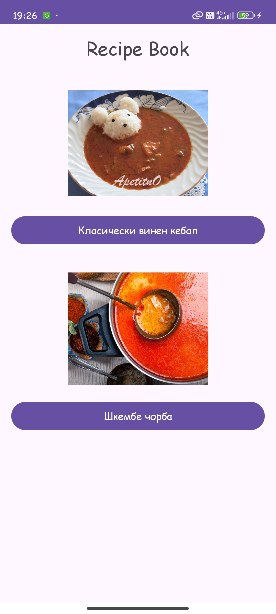
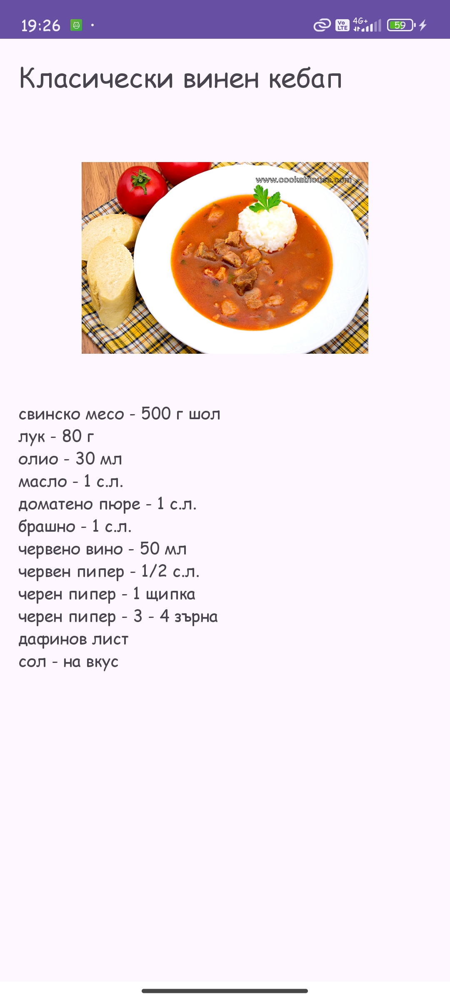
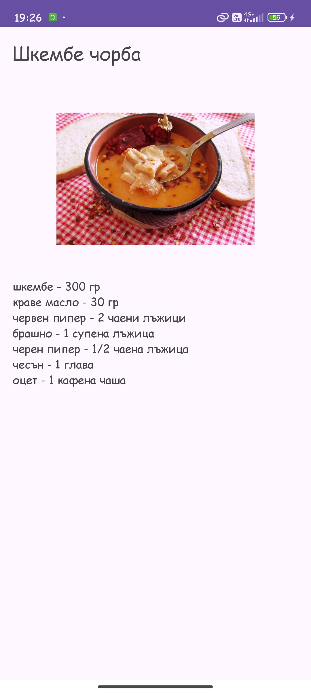

#RecipeBook - мобилно приложение за Android
## 1. Идея
RecipeBook е мобилно приложение за Android, което показва списък с рецепти и
позволява отваряне на детайлен екран за всяка рецепта. Целта е да се демонстрират основните
елементи на Android разработката - Activity-та, навигация, Material 3 дизайн и работа с
текстове и изображения.

##2. Как работи
Приложението съдържа два основни екрана.
Първият е MainActivity, който показва заглавие и бутони
за избор на рецепта. Над бутоните са визуализирани изображения, заредени от drawable.
При натискане на бутон се създава Intent, който предава към RecipeDetailsActivity заглавие,
изображение и продуктите на избраната рецепта.
Вторият е RecipeDetailsActivity, който визуализира получените данни: заглавие, снимка и текст
с продуктите. Навигацията е реализирана чрез стандартен Android Intent. Интерфейсът използва
Material 3 тема с поддръжка на light/dark режим.
Приложението се компилира и стартира без грешки на устройства с Android 7.0 (Min SDK 24).
Целта ми е да покрия минималните изисквания за оценка 3: два екрана, навигация, Material 3 и APK.

##3. Архитектура (MVVM)
- Език: Kotlin
- Архитектурен модел: опростен MVVM
- Компоненти:
- View: MainActivity, RecipeDetailsActivity
- ViewModel: RecipeViewModel
- Repository: RecipeRepository
- Ресурси: drawable, layout, values

##4. Потребителски поток
1. Потребителят стартира приложението -> MainActivity
2. Вижда заглавие, бутони и изображения
3. Натиска бутон за рецепта
4. Отваря се RecipeDetailsActivity
5. Вижда заглавие, снимка и продукти
6. Връща се назад със системния Back бутон

##5. Стъпки за стартиране
1. Клонирай репото:
2. Отвори проекта в Android Studio
3. Изчакай Gradle да се синхронизира
4. Стартирай на емулатор или реално устройство

##6. Тестови акаунти
Не са необходими - приложението работи без логин.

##7. Скриншотове
### Основен екран / dark тема

(docs/images/sn1.jpg)

### Основен екран / light тема

### Екран с рецепта / light тема

### Екран с рецепта / light тема

##8. APK
APK файлът се намира в

##9. Технологии
- Kotlin
- Min SDK: 24
- Material 3
- Gradle

##10. Авторство
Проектът е разработен самостоятелно за дисциплината "Мобилни приложения".
Git историята съдържа реални commit-u.
